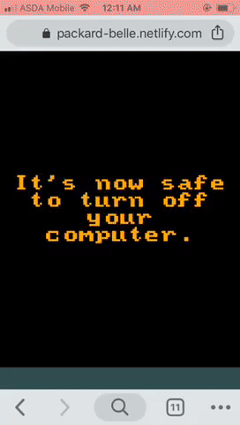

This project was bootstrapped with [Create React App](https://github.com/facebook/create-react-app).

# Things this site currently does

- Recreation of Windows 98 UI via [Packard Belle](https://www.npmjs.com/package/packard-belle)
- Somewhat mobile friendly (via defaulting to maximised windows and including alternative touch actions for doubleClicks)
- Resizable and draggable windows (via react-rnd)
- Launch and shut down screens
- State management via Context API
- Notepad recreation with the original font
- Set background image
- Abiliy to overwrite and save notepad files
- Persistent storage of background images and saved files via LocalStorage
- Mock MS DOS simulator (very basic)
- IFrames of other recreatios as an example of easy expansion

## How do I...

### See the launch screen again

Either clear your localStorage for the site or go through the shut down process

### Delete files

Unfortunately, you'll have to modify localStorage to do that at the moment

### Get rid of that annoying flicker and everything else

The answer is probably Start -> Settings -> Control Panel

# Goals

## Key Refactors

- [x] launch screen in vanilla JS to hide intiial load
- [x] conversion of data files to be easily swapped with JSON (i.e. just strings, booleans and numbers)
- [ ] CONTEXT (handle IDs instead of full program objects)
- [ ] CONTEXT: means of handling folders and plugging in custom data better
- [ ] CONTEXT: improve passing of props between sections
- [ ] UI Library: increase flexibility by passing unspecified props
- [ ] Reduced data-uri usage
- [ ] documentation for the file system API to allow easy expandability of said component
- [ ] Airbnb linting
- [ ] z-index layering reworking
- [ ] retain state of minimised programs (hide instead of removing)

## Important

- [x] persistent data via local storage (background images)
- [x] shutdown screen
- [x] Improved mobile operations (but can be improved further)
- [x] writable features via local storage (desktop only atm)
- [ ] documentation of states
- [ ] optimised bundles of this exported and the component library
- [ ] cypress testing of core features
- [ ] refactoring (renaming to match purposes better, reducing prop passing)
- [ ] save to other directories

## Novel stuff

- [x] Semi-working My Computer folder (e.g. contains a floppy disc icon that freezes the whole machine for 10 seconds before saying no floppy is inserted)
- [ ] Blue screen on all crashes
- [ ] minesweeper difficulty options
- [ ] Napster simulator (I've never actually used Napster so if you have then this will suck)
- [ ] Images viewer, images folder
- [ ] An actual working minesweeper (seems like an easy afternoon job?), separate component package
- [ ] collection of easy additional components to write (e.g. calculator)
- [ ] IE Naviagtion works for pages on same site and dangerously inserted innerHTML
- [ ] Save other file types (write HTML files in notepad for IE4?)
- [ ] windows XP skin (should be pretty doable and able to be its own CSS file with how the componets are written)

## Proof of concepts

- [ ] exportable as a single lightly modifiable component
- [ ] one multiwindow app that runs in background (AIM?)
- [ ] simple user accounts
- [ ] server communications
- [ ] server side rendering is more feasible (usage of window currently makes that hard)
- [ ] writable features communicate with server (allowing users to log in)

# Credits go to:

- https://github.com/1j01/jspaint for JS Paint
- https://www.npmjs.com/package/packard-belle I stole some of their icons
- https://github.com/react95/react95 I also stole some of their icons
- https://github.com/1000hz/winmine-exe for an amazing version of MSSansSerif
- https://github.com/ShizukuIchi/ for reminding me to finish this thing after seeing his great XP one
- https://int10h.org/oldschool-pc-fonts/fontlist/ for the boot screen font
- https://codepen.io/lbebber/pen/XJRdrV for that great CRT effect
- https://basicallydan.github.io/skifree.js/ for skifree
- all the people I've forgotten

